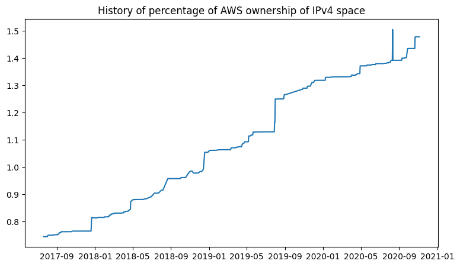

# AWS's ip-ranges.json

AWS provides a data file showing the current IP ranges their
services use, called [ip-ranges.json](https://ip-ranges.amazonaws.com/ip-ranges.json).  You 
can read more about the file [here](https://docs.aws.amazon.com/general/latest/gr/aws-ip-ranges.html).

This repository tracks changes to that file, and based off a trigger on the SNS topic 
automatically produces this chart showing how what percentage of the Internet's IPv4 
address space AWS is in control of.

# Last 10 updates:

| | Percent | IPs | Change | CIDRs |
| :--- | ---: | ---: | ---: | :--- |
| 2020-08-11 04:19:13 | 1.39151 | 51517194 | +256 | +15.230.49.0/24 |
| 2020-08-11 01:19:13 | 1.39150 | 51516938 | -4 | -15.230.131.6/31, -15.230.131.8/31 |
| 2020-08-10 07:09:14 | 1.39150 | 51516942 | +4 | +15.230.131.6/31, +15.230.131.8/31 |
| 2020-08-10 06:49:13 | 1.39150 | 51516938 | +6 | +15.230.131.0/30, +15.230.131.4/31 |
| 2020-08-10 00:49:14 | 1.39150 | 51516932 | +16 | +69.107.6.160/28 |
| 2020-08-07 18:49:13 | 1.39150 | 51516916 | 0 |  |
| 2020-08-07 04:49:14 | 1.39150 | 51516916 | 0 |  |
| 2020-08-07 04:09:13 | 1.39150 | 51516916 | 0 |  |
| 2020-08-06 22:39:14 | 1.39150 | 51516916 | +131072 | +15.156.0.0/15 |
| 2020-08-06 22:19:14 | 1.38796 | 51385844 | +131072 | +3.98.0.0/15 |

# 10 largest changes to date:

| | Percent | IPs | Change | CIDRs |
| :--- | ---: | ---: | ---: | :--- |
| 2019-08-01 20:03:05 | 1.24953 | 46260706 | +3145728 | +44.192.0.0/10, -3.192.0.0/12 |
| 2018-12-18 21:54:17 | 1.05392 | 39019010 | +2228224 | +3.208.0.0/12, +3.224.0.0/12, +13.48.0.0/15 |
| 2017-12-21 20:12:10 | 0.81440 | 30151184 | +1703936 | +18.208.0.0/13, +18.204.0.0/14, +18.224.0.0/14, ... |
| 2018-08-22 21:22:35 | 0.95738 | 35444840 | +1572864 | +3.80.0.0/12, +3.16.0.0/14, +3.40.0.0/14 |
| 2019-07-30 16:43:04 | 1.16456 | 43114908 | +1310720 | +3.192.0.0/12, +15.222.0.0/15, +15.236.0.0/15 |
| 2020-04-29 00:13:11 | 1.37105 | 50759849 | +1048576 | +35.72.0.0/13, +65.0.0.0/14, +13.212.0.0/15, ... |
| 2018-04-25 16:16:17 | 0.86887 | 32167704 | +917504 | +100.24.0.0/13, +63.32.0.0/14, +99.80.0.0/15 |
| 2019-10-28 01:03:09 | 1.28580 | 47603480 | +732413 | +3.136.0.0/13, +18.166.0.0/15, +18.252.0.0/16, ... |
| 2019-05-08 20:19:04 | 1.11038 | 41109242 | +655360 | +3.248.0.0/13, +18.142.0.0/15 |
| 2019-07-18 21:23:05 | 1.12920 | 41805914 | +655224 | +52.208.0.0/14, +52.214.0.0/15, +52.213.0.0/16, ... |
