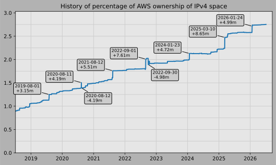

# AWS's ip-ranges.json

AWS provides a data file showing the current IP ranges their
services use, called [ip-ranges.json](https://ip-ranges.amazonaws.com/ip-ranges.json).
You can read more about the file [here](https://docs.aws.amazon.com/general/latest/gr/aws-ip-ranges.html).
If you want to look up an IP address, you can see if it's from any of the cloud providers using [this tool](https://cloud-ips.s3-us-west-2.amazonaws.com/index.html).

This repository tracks changes to that file, and based off a trigger on the SNS 
topic automatically produces this chart showing how what percentage of the 
Internet's IPv4 address space AWS is in control of.  Here's some 
more [information about when different regions](announces.md) came 
online, and here's an [animation of the history](https://youtu.be/v__lzuvKxU0) 
of the AWS's IP usage.

To get updates as they happen:

[Comparing to other providers](https://github.com/seligman/cloud_sizes), as of 2026-06-02:

| | IPs | Percent |
| --- | ---: | ---: |
| Amazon AWS | 101,735,048 | 2.74792 |
| Microsoft Azure | 49,973,869 | 1.34982 |
| Google Cloud | 17,429,376 | 0.47078 |

# Last 15 updates:

(Changes that do not impact the counts are not shown)

| | Percent | IPs | Change | CIDRs |
| :--- | ---: | ---: | ---: | :--- |
| 2026&#8209;06&#8209;02&nbsp;19:27:05 | 2.74792 | 101,735,048 | +4,608 | +15.129.64.0/21,&nbsp;+15.129.72.0/22,&nbsp;+15.129.96.0/22,&nbsp;... |
| 2026&#8209;06&#8209;02&nbsp;17:12:45 | 2.74779 | 101,730,440 | +768 | +15.129.62.0/23,&nbsp;+15.129.61.0/24 |
| 2026&#8209;06&#8209;01&nbsp;18:37:06 | 2.74777 | 101,729,672 | -512 | -1.178.86.0/23 |
| 2026&#8209;05&#8209;28&nbsp;04:47:05 | 2.74779 | 101,730,184 | +16 | +69.107.13.0/28 |
| 2026&#8209;05&#8209;28&nbsp;02:37:06 | 2.74779 | 101,730,168 | +256 | +45.33.178.0/24 |
| 2026&#8209;05&#8209;27&nbsp;00:57:05 | 2.74778 | 101,729,912 | +2,048 | +43.195.16.0/22,&nbsp;+43.193.66.0/23,&nbsp;+43.195.20.0/23 |
| 2026&#8209;05&#8209;26&nbsp;20:17:06 | 2.74772 | 101,727,864 | +256 | +5.60.16.0/24 |
| 2026&#8209;05&#8209;25&nbsp;22:57:05 | 2.74772 | 101,727,608 | +2 | +51.0.250.2/31 |
| 2026&#8209;05&#8209;25&nbsp;16:17:06 | 2.74772 | 101,727,606 | +4 | +104.255.56.66/31,&nbsp;+104.255.56.65/32,&nbsp;+104.255.56.68/32 |
| 2026&#8209;05&#8209;25&nbsp;11:47:06 | 2.74772 | 101,727,602 | +2 | +104.255.58.238/31 |
| 2026&#8209;05&#8209;22&nbsp;06:27:05 | 2.74772 | 101,727,600 | +16 | +69.107.12.240/28 |
| 2026&#8209;05&#8209;22&nbsp;04:17:04 | 2.74772 | 101,727,584 | +256 | +45.33.177.0/24 |
| 2026&#8209;05&#8209;22&nbsp;02:17:04 | 2.74771 | 101,727,328 | +4 | +15.248.165.0/30 |
| 2026&#8209;05&#8209;20&nbsp;13:47:05 | 2.74771 | 101,727,324 | -1,024 | -64.73.198.0/23,&nbsp;-64.73.200.0/23 |
| 2026&#8209;05&#8209;20&nbsp;11:37:04 | 2.74774 | 101,728,348 | -256 | -64.73.195.0/24 |

# 15 largest changes to date:

| | Percent | IPs | Change | CIDRs |
| :--- | ---: | ---: | ---: | :--- |
| 2025&#8209;03&#8209;10&nbsp;16:53:20 | 2.40727 | 89,123,427 | +6,225,920 | +100.48.0.0/12,&nbsp;+16.144.0.0/13,&nbsp;+16.192.0.0/13,&nbsp;... |
| 2021&#8209;08&#8209;12&nbsp;18:31:15 | 1.75915 | 65,128,214 | +5,505,024 | +3.48.0.0/12,&nbsp;+35.96.0.0/12,&nbsp;+3.152.0.0/13,&nbsp;... |
| 2022&#8209;08&#8209;31&nbsp;20:33:06 | 1.93002 | 71,454,285 | +4,718,592 | +98.80.0.0/12,&nbsp;+184.32.0.0/12,&nbsp;+13.184.0.0/13,&nbsp;... |
| 2020&#8209;08&#8209;11&nbsp;16:19:14 | 1.50480 | 55,711,498 | +4,194,304 | +252.0.0.0/10 |
| 2020&#8209;08&#8209;12&nbsp;19:21:14 | 1.39151 | 51,517,198 | -4,194,304 | -252.0.0.0/10 |
| 2022&#8209;09&#8209;29&nbsp;20:23:06 | 1.89058 | 69,994,058 | -3,932,160 | -3.48.0.0/12,&nbsp;-35.96.0.0/12,&nbsp;-3.240.0.0/13,&nbsp;... |
| 2017&#8209;06&#8209;29&nbsp;22:42:11 | 0.74955 | 27,750,448 | +3,429,728 | +13.232.0.0/13,&nbsp;+34.240.0.0/13,&nbsp;+35.168.0.0/13,&nbsp;... |
| 2019&#8209;08&#8209;01&nbsp;20:03:05 | 1.24953 | 46,260,706 | +3,145,728 | +44.192.0.0/10,&nbsp;-3.192.0.0/12 |
| 2017&#8209;04&#8209;07&nbsp;18:22:10 | 0.65692 | 24,320,720 | +3,025,152 | +34.208.0.0/12,&nbsp;+34.224.0.0/12,&nbsp;+13.58.0.0/15,&nbsp;... |
| 2022&#8209;10&#8209;11&nbsp;22:43:07 | 1.96491 | 72,746,202 | +2,752,512 | +51.24.0.0/13,&nbsp;+57.104.0.0/13,&nbsp;+51.20.0.0/14,&nbsp;... |
| 2024&#8209;01&#8209;23&nbsp;21:43:07 | 2.10814 | 78,048,717 | +2,359,552 | +56.48.0.0/13,&nbsp;+16.28.0.0/14,&nbsp;+16.64.0.0/14,&nbsp;... |
| 2018&#8209;12&#8209;18&nbsp;21:54:17 | 1.05392 | 39,019,010 | +2,228,224 | +3.208.0.0/12,&nbsp;+3.224.0.0/12,&nbsp;+13.48.0.0/15 |
| 2016&#8209;04&#8209;22&nbsp;18:22:20 | 0.46701 | 17,290,016 | +2,214,656 | +52.200.0.0/13,&nbsp;+52.208.0.0/13,&nbsp;+52.36.0.0/14,&nbsp;... |
| 2025&#8209;03&#8209;10&nbsp;19:53:18 | 2.47277 | 91,548,259 | +1,900,544 | +16.22.0.0/15,&nbsp;+16.48.0.0/15,&nbsp;+16.58.0.0/15,&nbsp;... |
| 2022&#8209;10&#8209;12&nbsp;21:13:09 | 1.91535 | 70,911,194 | -1,835,008 | -13.192.0.0/13,&nbsp;-16.28.0.0/14,&nbsp;-40.172.0.0/14,&nbsp;... |

If you find this project useful, consider [buying me a cup coffee](https://coff.ee/seligman).  Thanks!
