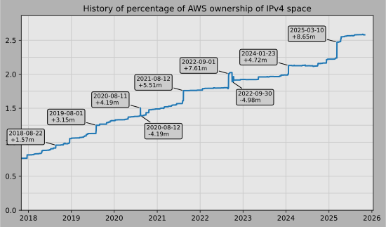

# AWS's ip-ranges.json

AWS provides a data file showing the current IP ranges their
services use, called [ip-ranges.json](https://ip-ranges.amazonaws.com/ip-ranges.json).
You can read more about the file [here](https://docs.aws.amazon.com/general/latest/gr/aws-ip-ranges.html).
If you want to look up an AWS IP address, you can search for its presence in ip-ranges.json using [this tool](https://seligman.github.io/aws-ip-ranges/).

This repository tracks changes to that file, and based off a trigger on the SNS topic 
automatically produces this chart showing how what percentage of the Internet's IPv4 
address space AWS is in control of.  Here's an 
[animation of the history](https://youtu.be/Su25yl7eol8) of the AWS's IP usage.

To get updates as they happen:

 

[Comparing to other providers](https://github.com/seligman/cloud_sizes), as of 2022-08-09:

| | IPs | Percent |
| --- | ---: | ---: |
| Amazon AWS | 66,730,553 | 1.8024% |
| Microsoft Azure | 26,998,917 | 0.7293% |
| Google Cloud | 10,565,888 | 0.2854% |

# Last 15 updates:

(Changes that do not impact the counts are not shown)

| | Percent | IPs | Change | CIDRs |
| :--- | ---: | ---: | ---: | :--- |
| 2022&#8209;08&#8209;09&nbsp;21:23:09 | 1.80243 | 66,730,553 | +256 | +15.230.250.0/24 |
| 2022&#8209;08&#8209;09&nbsp;16:43:05 | 1.80242 | 66,730,297 | +2,048 | +15.220.144.0/21 |
| 2022&#8209;08&#8209;09&nbsp;06:13:05 | 1.80237 | 66,728,249 | +64 | +13.34.79.128/26 |
| 2022&#8209;08&#8209;08&nbsp;09:13:07 | 1.80236 | 66,728,185 | +64 | +13.34.79.64/26 |
| 2022&#8209;08&#8209;05&nbsp;13:43:05 | 1.80236 | 66,728,121 | +16,386 | +18.88.0.0/18,&nbsp;+150.222.27.234/31 |
| 2022&#8209;08&#8209;05&nbsp;07:23:05 | 1.80192 | 66,711,735 | +3 | +150.222.27.18/31,&nbsp;+150.222.27.12/32 |
| 2022&#8209;08&#8209;05&nbsp;03:13:05 | 1.80192 | 66,711,732 | +256 | +15.230.249.0/24 |
| 2022&#8209;08&#8209;04&nbsp;18:03:07 | 1.80191 | 66,711,476 | +6,144 | +15.220.128.0/20,&nbsp;+15.220.120.0/21 |
| 2022&#8209;08&#8209;03&nbsp;01:13:07 | 1.80175 | 66,705,332 | +8 | +142.4.160.152/29 |
| 2022&#8209;08&#8209;02&nbsp;22:33:05 | 1.80175 | 66,705,324 | +8 | +142.4.160.144/29 |
| 2022&#8209;08&#8209;02&nbsp;21:53:06 | 1.80175 | 66,705,316 | +2,048 | +15.220.112.0/21 |
| 2022&#8209;08&#8209;02&nbsp;20:53:05 | 1.80169 | 66,703,268 | +256 | +3.2.36.0/25,&nbsp;+3.2.32.0/26,&nbsp;+3.2.33.192/26 |
| 2022&#8209;08&#8209;01&nbsp;22:13:05 | 1.80168 | 66,703,012 | +1 | +13.34.9.76/32 |
| 2022&#8209;07&#8209;29&nbsp;18:13:08 | 1.80168 | 66,703,011 | +256 | +99.83.102.0/24 |
| 2022&#8209;07&#8209;29&nbsp;17:03:06 | 1.80168 | 66,702,755 | +2 | +15.230.169.6/31 |

# 15 largest changes to date:

| | Percent | IPs | Change | CIDRs |
| :--- | ---: | ---: | ---: | :--- |
| 2021&#8209;08&#8209;12&nbsp;18:31:15 | 1.75915 | 65,128,214 | +5,505,024 | +3.48.0.0/12,&nbsp;+35.96.0.0/12,&nbsp;+3.152.0.0/13,&nbsp;... |
| 2020&#8209;08&#8209;11&nbsp;16:19:14 | 1.50480 | 55,711,498 | +4,194,304 | +252.0.0.0/10 |
| 2020&#8209;08&#8209;12&nbsp;19:21:14 | 1.39151 | 51,517,198 | -4,194,304 | -252.0.0.0/10 |
| 2017&#8209;06&#8209;29&nbsp;22:42:11 | 0.74955 | 27,750,448 | +3,429,728 | +13.232.0.0/13,&nbsp;+34.240.0.0/13,&nbsp;+35.168.0.0/13,&nbsp;... |
| 2019&#8209;08&#8209;01&nbsp;20:03:05 | 1.24953 | 46,260,706 | +3,145,728 | +44.192.0.0/10,&nbsp;-3.192.0.0/12 |
| 2017&#8209;04&#8209;07&nbsp;18:22:10 | 0.65692 | 24,320,720 | +3,025,152 | +34.208.0.0/12,&nbsp;+34.224.0.0/12,&nbsp;+13.58.0.0/15,&nbsp;... |
| 2018&#8209;12&#8209;18&nbsp;21:54:17 | 1.05392 | 39,019,010 | +2,228,224 | +3.208.0.0/12,&nbsp;+3.224.0.0/12,&nbsp;+13.48.0.0/15 |
| 2016&#8209;04&#8209;22&nbsp;18:22:20 | 0.46701 | 17,290,016 | +2,214,656 | +52.200.0.0/13,&nbsp;+52.208.0.0/13,&nbsp;+52.36.0.0/14,&nbsp;... |
| 2017&#8209;12&#8209;21&nbsp;20:12:10 | 0.81440 | 30,151,184 | +1,703,936 | +18.208.0.0/13,&nbsp;+18.204.0.0/14,&nbsp;+18.224.0.0/14,&nbsp;... |
| 2018&#8209;08&#8209;22&nbsp;21:22:35 | 0.95738 | 35,444,840 | +1,572,864 | +3.80.0.0/12,&nbsp;+3.16.0.0/14,&nbsp;+3.40.0.0/14 |
| 2019&#8209;07&#8209;30&nbsp;16:43:04 | 1.16456 | 43,114,908 | +1,310,720 | +3.192.0.0/12,&nbsp;+15.222.0.0/15,&nbsp;+15.236.0.0/15 |
| 2016&#8209;09&#8209;21&nbsp;12:34:06 | 0.54213 | 20,071,088 | +1,310,720 | +34.192.0.0/12,&nbsp;+35.156.0.0/14,&nbsp;+52.219.68.0/22,&nbsp;... |
| 2021&#8209;08&#8209;05&nbsp;18:21:13 | 1.61044 | 59,622,723 | +1,048,576 | +43.192.0.0/12 |
| 2020&#8209;10&#8209;22&nbsp;18:31:17 | 1.47052 | 54,442,529 | +1,048,576 | +3.64.0.0/12 |
| 2020&#8209;09&#8209;28&nbsp;13:51:16 | 1.42963 | 52,928,471 | +1,048,576 | +35.80.0.0/12 |
